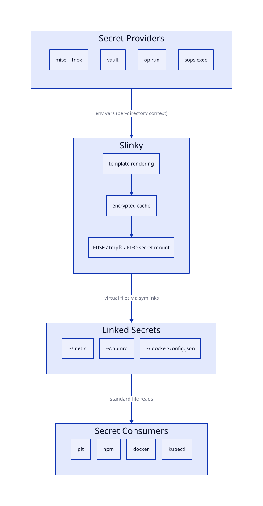
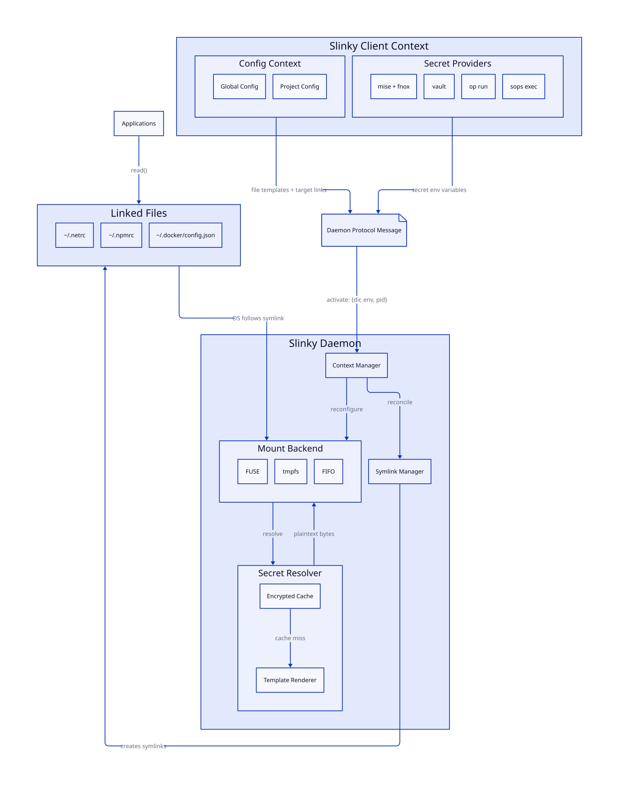

# slinky: a (s)ecret (link)ing utilit(y)

**Ephemeral, on-demand secret file materialization for developer workstations.**

`slinky` presents templated secret files (`.netrc`, `.npmrc`, `.docker/config.json`, etc.) at stable filesystem paths without ever persisting plaintext to disk. Secrets are resolved lazily from environment variables populated by your existing toolchain and cached in encrypted memory for fast repeated access.

## Motivation

Many developer tools expect secrets in well-known dotfiles: `~/.netrc` for git/curl authentication, `~/.npmrc` for registry tokens, `~/.docker/config.json` for container registries. The typical approaches to managing these files all have trade-offs:

- **Plaintext on disk** is the default and the worst option. Secrets persist indefinitely, survive reboots, are captured by backups, and are trivially exfiltrated by any process running as your user.

- **On-demand template rendering** is an improvement; you render the file from a template, use it, then delete it. But this is manual, error-prone (forget to clean up), and adds latency to every operation that needs the file.

- **On-demand environment injection** is better yet, allowing tools like `mise`, `fnox`, or `direnv` to load secrets into environment variables scoped per-directory. But if you need those same values composed into a structured file like `.netrc` or `.npmrc`, there's no built-in way to do that.

[1Password Environments](https://developer.1password.com/docs/environments/) solves this elegantly for `.env` files by intercepting reads and injecting secrets on the fly, but it only supports that one format.

`slinky` generalizes this model to arbitrary file templates. It runs as a lightweight daemon that exposes virtual files at stable paths. When a process reads one of these files, `slinky` renders the backing template using Go's `text/template` with values from environment variables and never writes plaintext to persistent storage. Rendered output is cached in encrypted memory with a configurable TTL so subsequent reads are fast.

Notably, `slinky` stores no secrets itself. Values come from environment variables that your existing tools have already populated, or — via first-class [integrations](#integration-with-existing-tools) — are pulled at render time from [fnox](https://fnox.jdx.dev), [secretspec](https://secretspec.dev), or 1Password (including desktop-app authenticated sessions). Either way, storage and authentication stay with the tools that already handle them well; slinky stays focused on one job — file materialization.

## Quickstart

1. **Install** — build from source with `go install github.com/kclejeune/slinky/cmd/slinky@latest`, or download a release archive from the [releases page](https://github.com/kclejeune/slinky/releases).

2. **Create a global config** using `slinky cfg init --global`, then edit it:

   ```toml
   # ~/.config/slinky/config.toml

   [settings.mount]
   backend = "fuse"

   [settings.cache]
   default_ttl = "5m"

   [files.netrc]
   template = "~/.config/slinky/templates/netrc.tpl"
   mode = 0o600
   symlink = "~/.netrc"
   ```

3. **Write a template** at `~/.config/slinky/templates/netrc.tpl`:

   ```
   machine github.com
     login {{ env "GITHUB_USERNAME" }}
     password {{ env "GITHUB_TOKEN" }}
   ```

4. **Install shell hooks** so the daemon captures your environment on each directory change. Run `slinky cfg hook` to generate hook code for your shell:

   ```bash
   # bash (~/.bashrc)
   echo 'eval "$(slinky cfg hook bash)"' >> ~/.bashrc

   # zsh (~/.zshrc)
   echo 'eval "$(slinky cfg hook zsh)"' >> ~/.zshrc

   # fish (~/.config/fish/config.fish)
   echo 'slinky cfg hook fish | source' >> ~/.config/fish/config.fish
   ```

   See [Shell integration](#shell-integration) for details and alternative integrations.

5. **Start the daemon** — install it as a system service so it starts automatically on login:

   ```bash
   slinky svc install
   ```

   Or start it manually for a one-off session:

   ```bash
   slinky start
   ```

6. **Verify**:
   ```bash
   cat ~/.netrc          # rendered from your env vars
   slinky status         # shows active files and sessions
   ```

## Shell integration

`slinky` depends on shell hooks to detect directory changes and activate the appropriate secrets context. Hooks call `slinky activate --hook` on each directory change and `slinky deactivate --hook` on shell exit.

### Native shell hooks

`slinky cfg hook` is the primary way to integrate slinky with any shell. It generates hook code for `bash`, `zsh`, or `fish` that you source in your shell's startup file. Reload your shell after adding the line:

```bash
# bash (~/.bashrc)
eval "$(slinky cfg hook bash)"

# zsh (~/.zshrc)
eval "$(slinky cfg hook zsh)"

# fish (~/.config/fish/config.fish)
slinky cfg hook fish | source
```

`slinky cfg hook` auto-detects your shell from the parent process if you omit the shell argument.

What each hook does:

- **bash**: appends `__slinky_hook` to `PROMPT_COMMAND`; fires on each prompt, compares `$PWD` to a saved value to detect changes; traps `EXIT` to deactivate.
- **zsh**: adds `__slinky_hook` to `chpwd_functions` (called automatically by zsh on `cd`); traps `EXIT` to deactivate.
- **fish**: registers `--on-variable PWD` and `--on-event fish_exit` event handlers.

The `--hook` flag used by these hooks suppresses success output and warns instead of erroring when the daemon isn't running, so they never break your shell.

### Session lifecycle

1. **Auto-detection:** `activate` and `deactivate` identify the terminal via `Getsid()` (session leader PID, typically the login shell). This is more reliable than `Getppid()` because hook runners (mise, direnv) may be intermediate processes that exit immediately.
2. **Reference counting:** Multiple shells can activate the same directory. Each shell's session PID is tracked separately. The activation persists until all sessions leave.
3. **Auto-deactivation:** Activating a new directory automatically removes the session from all previously activated directories, preventing file conflicts while navigating.
4. **Dead session reaping:** A background goroutine checks all tracked PIDs every 30 seconds using `kill(pid, 0)`. Dead sessions are removed, and any activation whose session set empties is fully deactivated.
5. **Force override:** `deactivate --session 0` removes an activation unconditionally.

### mise

If you use mise, you can call `slinky activate --hook` from the `[hooks.cd]` block instead of (or in addition to) native shell hooks:

```toml
# mise.toml (per-project)
[hooks.cd]
run = "slinky activate --hook"
```

mise fires `hooks.cd` after injecting project-specific env vars, so `slinky activate` captures exactly the right environment for that directory. A `leave` hook is not required — `activate` auto-deactivates the previous directory for the same session — but you can add one for explicit cleanup:

```toml
[hooks.leave]
run = "slinky deactivate --hook"
```

### direnv

```bash
# .envrc (per-project)
slinky activate --hook

deactivate() {
  slinky deactivate --hook
}
```

direnv loads `.envrc` on directory entry and unloads on exit. `slinky activate` captures whatever env vars direnv has set; `deactivate` cleans up when leaving.

## Configuration

`slinky` uses two kinds of config files:

- **Global config** (`~/.config/slinky/config.toml`) — daemon settings under `[settings]` and always-active file definitions under `[files]`
- **Project configs** (`.slinky.toml` in any directory) — directory-scoped file overrides activated when you `cd` into that directory tree

Use `slinky cfg init --global` to create the global config and `slinky cfg init` (no flag) to create a project config in the current directory. Use `slinky cfg edit` to open any config in `$EDITOR`, and `slinky cfg validate` to check configs for errors without starting the daemon.

### Global config

The global config is read at daemon startup from `~/.config/slinky/config.toml` (or `$XDG_CONFIG_HOME/slinky/config.toml`).

#### Full annotated example

```toml
# ─── Mount settings ────────────────────────────────────────────

[settings.mount]
# Mount backend: "fuse", "tmpfs", or "fifo"
#
# fuse:  Virtual filesystem. Files only exist in memory during read().
#        Requires macFUSE/FUSE-T on macOS, libfuse on Linux.
#
# tmpfs: RAM-backed real filesystem. Files exist as real inodes in RAM.
#        Plaintext is written to RAM, refreshed on a timer, and scrubbed
#        on unmount. No FUSE dependency. Requires mount privileges on Linux.
#
# fifo:  Named pipes (FIFOs) at the mount point. Secret content streams
#        through the kernel pipe buffer on each read; plaintext never rests
#        on any filesystem node. No FUSE dependency, no mount privileges
#        required. Best for one-shot readers (credential helpers, scripts).
#
# Default: "fuse"
backend = "fuse"

# Where to mount the virtual filesystem.
# All secret files appear as children of this directory.
# Default: "~/.secrets.d"
mount_point = "~/.secrets.d"


# ─── Cache settings ────────────────────────────────────────────

[settings.cache]
# Encryption backend for cached rendered templates. Cache entries are
# encrypted with an age X25519 keypair; the cipher determines where that
# keypair lives:
#
# ephemeral: (default) Keypair generated in memory at startup; the cache
#            is irrecoverable after daemon exit. ("age-ephemeral" is an
#            accepted alias.)
# keyring:   Keypair persisted in the OS credential store (macOS Keychain,
#            Linux Secret Service). "keychain" is an accepted alias.
# keyctl:    Keypair persisted in the Linux kernel user keyring (Linux only).
# auto:      Try keyring, then keyctl, then fall back to ephemeral.
#
# Default: "ephemeral"
cipher = "ephemeral"

# Default TTL for cached rendered output. After this duration the next
# read triggers a background re-render; stale content is served in the
# meantime so reads never block.
# Default: "5m"
default_ttl = "5m"


# ─── Audit settings ────────────────────────────────────────────

[settings.audit]
# Record every secret read served by the daemon to an append-only
# JSONL audit log. The FUSE backend records the calling process
# (PID, UID, process name); FIFO readers are anonymous. Reads of
# tmpfs-backed files happen entirely in the kernel and cannot be
# observed. View with `slinky audit`.
# Default: false
enabled = false

# Audit log path.
# Default: "~/.local/state/slinky/audit.log"
# log = "~/.local/state/slinky/audit.log"


# ─── Secret-manager integrations ───────────────────────────────
# Available in templates as {{ fnox "KEY" }}, {{ secretspec "KEY" }},
# and {{ op "op://vault/item/field" }}. All settings are optional —
# the functions work with each tool's own defaults.

[settings.integrations.fnox]
# bin = "fnox"            # binary to invoke
# profile = "production"  # fnox --profile for all lookups

[settings.integrations.secretspec]
# bin = "secretspec"
# profile = "development" # secretspec --profile
# provider = "keyring"    # secretspec --provider

[settings.integrations.onepassword]
# How to authenticate:
#   auto:            (default) service account token if present, else
#                    desktop app via the SDK (CGO builds), else op CLI
#   desktop-app:     1Password desktop app via the official Go SDK;
#                    requires 'account' and a CGO-enabled build
#   service-account: SDK with a service account token
#   cli:             op CLI (works with the CLI's own desktop app
#                    integration or op signin)
# auth = "auto"
# account = "my.1password.com"           # desktop-app account name
# token_env = "OP_SERVICE_ACCOUNT_TOKEN" # env var holding the token
# bin = "op"                             # CLI binary for cli mode


# ─── Symlink settings ──────────────────────────────────────────

[settings.symlink]
# What to do when a non-managed file already exists at a symlink path.
#
# error:  (default) Return an error. The conflicting file is left in place.
# backup: Rename the existing file (append backup_extension) before linking.
conflict = "error"

# Suffix appended to backed-up files when conflict = "backup".
# Default: "~"
backup_extension = "~"


# ─── Project config filenames ──────────────────────────────────
# Override the filenames searched when discovering project configs.
# Default: [".slinky.toml", "slinky.toml", ".slinky/config.toml", "slinky/config.toml"]
# project_config_names = [".slinky.toml"]


# ─── File definitions ──────────────────────────────────────────
#
# Each [files.<name>] block defines a secret file to expose.
# <name> becomes the filename under the mount point.
# Nested names like "docker/config.json" create subdirectories automatically.
#
# Render modes:
#   "native" (default)  slinky renders the template using Go's text/template.
#   "command"           slinky shells out to an external command (stdout = content).


[files.netrc]
template = "~/.config/slinky/templates/netrc.tpl"
mode = 0o600
ttl = "15m"
symlink = "~/.netrc"
# render = "native"  (default, can be omitted)

[files.npmrc]
template = "~/.config/slinky/templates/npmrc.tpl"
mode = 0o600
ttl = "5m"
symlink = "~/.npmrc"

[files."docker/config.json"]
template = "~/.config/slinky/templates/docker-config.tpl"
mode = 0o600
ttl = "10m"
symlink = "~/.docker/config.json"

# For target formats that themselves contain "{{" (Helm values,
# Prometheus configs, ...), override the template action delimiters:
#
# [files."helm-values.yaml"]
# template = "~/.config/slinky/templates/helm-values.tpl"
# delims = ["<<", ">>"]        # then write << env "TOKEN" >> in the template


# ─── Command render mode ───────────────────────────────────────
# Use when your provider has its own template engine (e.g., op inject)
# or when you have existing render scripts.

# [files.netrc]
# render = "command"
# command = "op"
# args = ["inject", "-i", "~/.config/slinky/templates/netrc.op.tpl"]
# mode = 0o600
# ttl = "15m"
# symlink = "~/.netrc"
```

### Project configs (`.slinky.toml`)

Run `slinky cfg init` in any project directory to generate a starter project config, or `slinky cfg edit` to open an existing one. Project configs may only contain `[files.*]` sections — `[settings]` is daemon-global and will be rejected with an error if present.

```toml
# ~/work/org-a/.slinky.toml

[files.netrc]
template = "~/.config/slinky/templates/org-a-netrc.tpl"
mode = 0o600
symlink = "~/.netrc"

[files."docker/config.json"]
template = "~/.config/slinky/templates/org-a-docker.tpl"
mode = 0o600
symlink = "~/.docker/config.json"
```

When `slinky activate` is called from a directory, the daemon walks up the directory tree to `$HOME`, collecting project config files at each level. It checks for (in order): `.slinky.toml`, `slinky.toml`, `.slinky/config.toml`, `slinky/config.toml`. Layers are merged using a **deepest-wins-per-file-name** strategy:

1. Start with the global config's `[files.*]` as the base
2. Overlay project config layers from shallowest to deepest
3. A project config definition wins over the global one entirely (no field-level merge)
4. Global files not overridden by any project config remain in the effective set

Each layer's files carry the environment captured at activation time, so `env()` in templates uses the shell's variables from the moment of `cd` — not the daemon's own environment.

#### Multi-project activation

Activations are **additive**: calling `activate` for project A and then project B mounts secrets for both simultaneously. Each activation is keyed by its directory path. Re-activating the same directory updates it in place (e.g., refreshing captured env vars).

**Conflict rule:** If two different activations define the same file name, `activate` returns an error and daemon state is unchanged. A single activation overriding a global file is always allowed — the conflict check only applies between simultaneous activations.

Use `slinky deactivate [dir]` to remove one activation without affecting others.

> **Environment merging for global files:** When multiple directories are activated simultaneously, their captured environments are merged (in alphabetical directory order, last wins per key) and applied to global file definitions. If you don't want one project's env leaking into another project's global file renders, define the files in `.slinky.toml` project configs instead.

#### Merge example

```
Global config:              {netrc: tplA, npmrc: tplB}
~/work/org-a/.slinky.toml:   {netrc: tplC, docker/config.json: tplD}
~/work/org-b/.slinky.toml:   {npmrc: tplE}

# Activate org-a: project layer overrides global netrc, adds docker
slinky activate ~/work/org-a
  → effective: {netrc: tplC (org-a env), npmrc: tplB (global), docker/config.json: tplD (org-a env)}

# Activate org-b (additive): org-b overrides global npmrc, org-a still active
slinky activate ~/work/org-b
  → effective: {netrc: tplC (org-a env), npmrc: tplE (org-b env), docker/config.json: tplD (org-a env)}

# Deactivate org-a: only org-b remains, global netrc restored
slinky deactivate ~/work/org-a
  → effective: {netrc: tplA (global), npmrc: tplE (org-b env)}

# If org-b also defined "netrc", the second activate would fail —
# conflicting files must live in the global config or separate dirs.
```

## Template rendering

### Native mode (default)

Native mode uses Go's [`text/template`](https://pkg.go.dev/text/template) with all [sprout](https://github.com/go-sprout/sprout) functions available, plus a small set of slinky-specific builtins.

When using directory-scoped contexts, `env()` and `envDefault()` first check the per-context environment captured at activation time, then fall back to `os.LookupEnv`. This means the same template renders different content in different directories based on what env vars each directory's hook provides.

If the target format itself contains `{{` (Helm values files, Prometheus configs, other Go templates), set `delims = ["<<", ">>"]` on the file definition and write template actions with those delimiters instead — everything else, including literal `{{`, passes through untouched.

#### Built-in template functions

**`env`** — Required environment variable. Returns an error during rendering if unset.

```
{{ env "GITHUB_TOKEN" }}
```

**`envDefault`** — Environment variable with a fallback value.

```
{{ envDefault "CUSTOM_HOST" "registry.example.com" }}
```

**`file`** — Read a file's contents. Paths are expanded (`~`, env vars).

```
{{ file "~/.config/git/username" | trimSpace }}
```

**`exec`** — Run a command and return its stdout (10 s timeout). Runs in the file's project directory for project-scoped files. Use sparingly — if most values come from `exec`, consider command render mode instead.

```
{{ exec "date" "+%Y-%m-%d" }}
```

**`fnox`** — Resolve a secret from [fnox](https://fnox.jdx.dev) (see [Integrations](#integration-with-existing-tools)).

```
{{ fnox "DATABASE_URL" }}
```

**`secretspec`** — Resolve a declared secret via [secretspec](https://secretspec.dev).

```
{{ secretspec "NPM_TOKEN" }}
```

**`op`** — Resolve a 1Password [secret reference](https://developer.1password.com/docs/cli/secret-references/) via the SDK (desktop app or service account) or the op CLI.

```
{{ op "op://Private/GitHub PAT/credential" }}
```

All [sprout functions](https://docs.atom.codes/sprout) are available: `b64enc`, `b64dec`, `upper`, `lower`, `trimSpace`, `replace`, `join`, `list`, `default`, `ternary`, `toJson`, and many more.

#### Template examples

`.netrc` with multiple registries:

```
machine github.com
  login {{ env "GITHUB_USERNAME" }}
  password {{ env "GITHUB_TOKEN" }}

machine gitlab.com
  login {{ env "GITLAB_USERNAME" }}
  password {{ env "GITLAB_TOKEN" }}

machine {{ envDefault "REGISTRY_HOST" "registry.example.com" }}
  login {{ env "REGISTRY_USER" }}
  password {{ env "REGISTRY_TOKEN" }}
```

`.npmrc` with scoped registries:

```
//registry.npmjs.org/:_authToken={{ env "NPM_TOKEN" }}
//npm.pkg.github.com/:_authToken={{ env "GITHUB_TOKEN" }}
@myorg:registry=https://npm.pkg.github.com
```

`docker/config.json` with base64-encoded auth:

```json
{
  "auths": {
    "ghcr.io": {
      "auth": "{{ list (env "GITHUB_USERNAME") (env "GITHUB_TOKEN") | join ":" | b64enc }}"
    },
    "registry.gitlab.com": {
      "auth": "{{ list (env "GITLAB_USERNAME") (env "GITLAB_TOKEN") | join ":" | b64enc }}"
    }
  }
}
```

### Command mode

Command mode delegates rendering entirely to an external process. The command's stdout becomes the file content. For project-scoped files the command runs in the file's project directory, so tools that discover their config from the working directory behave as if you ran them in the project yourself.

Use this when:

- Your provider has its own template engine (e.g., `op inject` with `{{ op://... }}` syntax)
- You have existing render scripts you don't want to rewrite

```toml
[files.netrc]
render = "command"
command = "op"
args = ["inject", "-i", "~/.config/slinky/templates/netrc.op.tpl"]
mode = 0o600
ttl = "15m"
symlink = "~/.netrc"
```

The cache key uses `SHA-256(template file contents) + file name` if a `template` path is provided, or `SHA-256(command + args)` if not. Setting `template` in command mode is recommended so the cache key tracks the template file's content rather than just the static command string:

```toml
[files.netrc]
render = "command"
template = "~/.config/slinky/templates/netrc.op.tpl"  # cache key only
command = "op"
args = ["inject", "-i", "~/.config/slinky/templates/netrc.op.tpl"]
```

## Mount backends

### FUSE

The FUSE backend implements a virtual filesystem using `go-fuse`. Files exist only as in-memory responses to `read()` syscalls — plaintext never lands anywhere persistent.

**Security:** `FOPEN_DIRECT_IO` bypasses the kernel page cache, so the OS holds no copy after the read completes. Memory is zeroed when the file handle is released.

**Requirements:**

- Linux: `libfuse3` (installed by default on most distributions)
- macOS: [macFUSE](https://osxfuse.github.io/) or [FUSE-T](https://www.fuse-t.org/) (kext-free, uses NFS translation)

**When to use:** Default choice. Best security posture. Use this unless you have a specific reason not to.

### tmpfs

The tmpfs backend mounts a RAM-backed filesystem and writes rendered secret files as real inodes. A background goroutine re-renders files on a timer (at half the minimum TTL) and zero-overwrites all content on unmount.

**Security:** Plaintext exists as real file content in RAM for the duration of the refresh cycle. On Linux, it could theoretically swap to disk under memory pressure unless you configure `mlock` or `noswap`.

**Requirements:**

- Linux: `mount` privileges for `tmpfs` (typically `CAP_SYS_ADMIN`; alternatively, use a user namespace)
- macOS: `hdiutil` and `diskutil` (available by default)

**When to use:** When FUSE is unavailable — corporate macOS with kernel extension restrictions, CI environments, containers without `/dev/fuse`.

### FIFO

The FIFO backend creates named pipes at the mount point — one per file. When a consumer opens and reads a FIFO, the backend resolves the secret and streams it through the kernel pipe buffer. After the read, the pipe is empty again.

**Security:** Plaintext transits only through the kernel pipe buffer — never written to any file, RAM disk, or page cache. The daemon zeros its heap copy immediately after the write.

**Requirements:** None beyond a writable directory. No FUSE library, no mount privileges.

**Limitations:**

- Single-reader-per-write semantics: if two processes open the same FIFO simultaneously, only the first reader gets content; the second receives EOF and must re-open.
- Programs that `mmap` files or expect `stat(2)` to report a non-zero size will not work.

**When to use:** When neither FUSE nor tmpfs is available, or when you need the strongest guarantee that secret content never rests anywhere — CI pipelines, credential helper scripts, minimal containers.

## Scope

### What slinky does

- Presents templated secret files at stable filesystem paths via FUSE, tmpfs, or FIFO named pipes — without ever writing plaintext to disk
- Renders templates using Go's `text/template` with [sprout](https://github.com/go-sprout/sprout) functions, or delegates rendering to any external command (`op inject`, custom scripts, etc.)
- Activates directory-scoped contexts via shell hooks: project configs (`.slinky.toml`) extend or override global file definitions per directory
- Tracks sessions by process group, with additive multi-project activation, auto-deactivation on directory change, and background reaping of dead shell processes
- Caches rendered output encrypted in memory with a configurable TTL; serves stale content while refreshing in the background; scrubs plaintext on file handle close and cache expiry
- Manages symlinks from conventional paths (`~/.netrc`) to the virtual mount point
- Optionally records an audit trail of every secret read the daemon serves, including the calling process identity on FUSE
- Installs as a launchd agent (macOS) or systemd user service (Linux); runs as your user, no root required (except tmpfs mount on Linux)

### What slinky does not do

- **It is not a secrets vault.** It stores no secrets of its own and has no unlock passphrase. Values come from environment variables or, via the [integrations](#integration-with-existing-tools), are pulled at render time from the managers that do own them (fnox, secretspec, 1Password) — authentication and storage stay entirely with those tools.
- **It is not a process isolation tool.** Any process running as your user can read the mounted files. It protects against secrets at rest on disk, not against malicious processes with your UID.
- **It does not manage environment variables.** Use `fnox`, `op run`, `direnv`, or `mise` for env var injection. `slinky` consumes those variables to produce _files_.

## Security model

**Project configs are executable code.** A `.slinky.toml` file can execute arbitrary commands via the `exec` template function and read arbitrary files via the `file` template function — both run as the daemon user. This is analogous to a `Makefile`, `.envrc`, or shell hook.

**Trust system.** To mitigate the risk of a malicious `.slinky.toml` being activated automatically (e.g. by cloning a repository with a shell hook enabled), slinky requires explicit approval before activating any project config for the first time:

```bash
# Trust the current project's .slinky.toml
slinky allow

# Revoke trust
slinky deny

# Audit the trust store
slinky trust list    # show each entry as current, stale, or missing
slinky trust prune   # drop entries whose config files no longer exist
```

The SHA-256 hash of each config file is stored in `~/.local/state/slinky/trusted.json`. If a config file changes (e.g. after a `git pull`), re-approval is required. This is the same model used by [direnv](https://direnv.net/).

**Global config is always trusted.** The global config at `~/.config/slinky/config.toml` is in a user-controlled location and is always accepted without approval.

**Templates are trusted code.** The `file` function reads any file accessible to your user, and `exec` runs arbitrary commands. Only use templates you wrote or reviewed.

**The daemon runs as your user** with the same filesystem and network access as your shell. Template execution is not sandboxed.

**The control socket is restricted to same-UID processes.** The socket directory is created with mode `0700`, and each connection is verified via OS-level peer credentials (`SO_PEERCRED` on Linux, `LOCAL_PEERCRED` on macOS).

**Environment variables are filtered before transmission.** On `activate`, the CLI walks the template AST to identify referenced variable names and only transmits those values plus a small allowlist of shell basics (`HOME`, `USER`, `LOGNAME`, `PATH`, `SHELL`, `TERM`, `LANG`) and `XDG_*` variables. The daemon caps env entries per request at 256.

**Reads can be audited.** Slinky cannot prevent a same-UID process from reading mounted files, but it can make reads observable. With `[settings.audit] enabled = true`, every read served by the daemon is appended to a JSONL audit log (`~/.local/state/slinky/audit.log` by default, mode `0600`). The FUSE backend records the calling PID, UID, and process name for each open; the FIFO backend records that content was served (pipe readers are anonymous). Reads of tmpfs-backed files happen entirely in the kernel and are not observable. View the trail with `slinky audit` (`-f` to follow, `--json` for raw lines). The audit log records *who read what and when* — never secret content.

**Secrets are stored only in encrypted memory.** Rendered output is encrypted with an age X25519 keypair and cached in-process. Entries are never written to persistent storage. With the default `ephemeral` cipher the private key exists only in daemon memory, so on daemon exit the key is gone and the cache is irrecoverable. The `keyring` and `keyctl` ciphers persist the keypair in the OS credential store or kernel keyring instead — the cache itself still never touches disk.

**Cleanup on deactivation.** When a context is deactivated or the reaper removes a dead session, files are zero-overwritten (tmpfs) and symlinks are removed.

**Threat model.** Slinky protects against secrets persisting on disk. It does not protect against a malicious process running as your user — any such process can read mounted files, attach a debugger to the daemon, or read `/proc/<pid>/mem`. The trust system protects against untrusted project configs executing commands as the daemon user.

## Integration with existing tools

`slinky` is a file materialization layer that sits downstream of your secrets management toolchain. Secrets reach templates two ways:

1. **Via environment variables** — any env-injection tool (mise, direnv, `op run`, `fnox exec`) populates the shell; `slinky activate` captures it; templates read `{{ env "KEY" }}`.
2. **Via first-class integrations** — templates pull directly from [fnox](https://fnox.jdx.dev), [secretspec](https://secretspec.dev), or 1Password at render time with the `fnox`, `secretspec`, and `op` template functions. No shell plumbing required, and values are only resolved when a file is actually rendered.



Integration lookups run in the project directory of the file's activation, so fnox and secretspec discover the project's own `fnox.toml` / `secretspec.toml`. Resolved values inherit the file's encrypted cache and TTL — providers are consulted once per render, not once per read. `slinky doctor` verifies that every integration your templates reference is installed and authenticable.

### fnox

[fnox](https://fnox.jdx.dev) stores secrets encrypted in git or as references to cloud providers. Two ways to combine it with slinky:

**Direct (template function):** Pull values straight from the project's `fnox.toml` — works even when no shell hook has run:

```
machine github.com
  login {{ fnox "GITHUB_USERNAME" }}
  password {{ fnox "GITHUB_TOKEN" }}
```

```toml
# Optional: pin a profile for all fnox lookups
[settings.integrations.fnox]
profile = "production"
```

**Via environment:** `eval "$(fnox activate bash)"` loads secrets into your shell on `cd`; slinky's own hook captures them for `{{ env "KEY" }}` templates. Use this when many tools consume the same env vars.

### secretspec

[secretspec](https://secretspec.dev) declares *what* secrets a project needs in a committed `secretspec.toml` while values live in a provider (keyring, 1Password, dotenv, ...). The `secretspec` template function resolves declared keys through the user's configured provider:

```
//registry.npmjs.org/:_authToken={{ secretspec "NPM_TOKEN" }}
```

```toml
# Optional: pin profile/provider instead of the user-level defaults
[settings.integrations.secretspec]
profile = "development"
provider = "keyring"
```

Because slinky runs `secretspec` in the project directory, each project resolves against its own declarations — and `secretspec check` remains the source of truth for what's required.

### 1Password

The `op` template function resolves [secret reference URIs](https://developer.1password.com/docs/cli/secret-references/):

```
machine github.com
  login {{ op "op://Private/GitHub/username" }}
  password {{ op "op://Private/GitHub/token" }}
```

Authentication (`settings.integrations.onepassword.auth`):

- **`auto`** (default) — a service account token (`OP_SERVICE_ACCOUNT_TOKEN`, from the daemon env or captured at activation) is used if present; otherwise the desktop app via the SDK when available; otherwise the `op` CLI.
- **`desktop-app`** — in-process via the official [1Password Go SDK](https://github.com/1Password/onepassword-sdk-go), authorized by the 1Password **desktop app**: no tokens on disk, human-in-the-loop approval, and automatic re-auth after the app locks/unlocks. Setup:
  1. In the 1Password app: **Settings → Developer → Integrate with other apps** (under "Integrate with the 1Password SDKs").
  2. Configure your account name as shown in the app's sidebar:
     ```toml
     [settings.integrations.onepassword]
     auth = "desktop-app"
     account = "my.1password.com"
     ```
  3. The first resolution triggers an authorization prompt in the 1Password app.
- **`service-account`** — in-process via the SDK using a [service account](https://developer.1password.com/docs/service-accounts/) token. Set `token_env` to read a different variable than `OP_SERVICE_ACCOUNT_TOKEN`.
- **`cli`** — shell out to `op read`. The CLI has its own desktop-app integration (**Settings → Developer → Integrate with 1Password CLI**), so biometric-backed desktop sessions work here too.

> **Build note:** the SDK's desktop-app integration requires a CGO-enabled build on macOS/Linux. `go install github.com/kclejeune/slinky/cmd/slinky@latest` on a machine with a C toolchain (any macOS with Xcode CLT) includes it. The prebuilt release archives are pure-Go: on those, `auto` transparently uses the `op` CLI — which still authenticates through the desktop app session. `slinky doctor` reports which path is active.

**Command render mode** remains available if you prefer `op inject` with its own template syntax:

```toml
[files.netrc]
render = "command"
command = "op"
args = ["inject", "-i", "~/.config/slinky/templates/netrc.op.tpl"]
```

### Any env-injection tool

Any tool that populates environment variables works. Start the daemon once, call `slinky activate` wherever your env vars are set, and the daemon captures them.

## Architecture



For internal details — package structure, data flow sequence diagrams, concurrency model, and component descriptions — see [docs/architecture.md](docs/architecture.md).

## CLI reference

```
slinky start                  # Start daemon in the background
slinky start -f               # Start daemon in the foreground
slinky start -m tmpfs         # Start with a specific backend (overrides config)
slinky run                    # Run daemon in the foreground (alias)
slinky stop                   # Stop daemon, unmount, clean up symlinks
slinky restart                # Restart the running daemon
slinky reload                 # Ask the running daemon to reload its config
slinky status                 # Show daemon status, active dirs, sessions, files
slinky status --json          # Machine-readable status output
slinky log                    # Show daemon log output
slinky log -f                 # Follow (tail) daemon log output

slinky activate [dir]         # Activate a directory context (default: $PWD)
slinky activate --hook        # Shell hook mode: suppress output, warn on failure
slinky deactivate [dir]       # Deactivate a directory context (default: $PWD)
slinky deactivate --session 0 # Force-remove regardless of other sessions
slinky deactivate --all       # Force-remove every active context
slinky exec -- cmd [args...]  # Run a command with a context active, then clean up

slinky allow [dir]            # Trust the project config in a directory
slinky deny [dir]             # Revoke trust for the project config in a directory
slinky trust list             # List trusted configs (current/stale/missing)
slinky trust prune            # Drop trust entries whose files no longer exist

slinky cfg [dir]              # Show resolved config hierarchy for a directory
slinky cfg init               # Create a project config (.slinky.toml) here
slinky cfg init --global      # Create the global config (~/.config/slinky/config.toml)
slinky cfg edit               # Open discovered config(s) in $EDITOR
slinky cfg edit --global      # Open global config in $EDITOR
slinky cfg validate           # Validate config files without starting the daemon
slinky cfg hook [bash|zsh|fish]  # Print shell hook code for eval integration

slinky render <name>          # Debug: render a single file to stdout without caching

slinky cache clear            # Evict all cached entries
slinky cache warm             # Pre-render all effective files into the cache
slinky cache stats            # Show cache hit/miss rates and entry ages
slinky cache list             # List cached entry keys
slinky cache get <key>        # Decrypt and print a cached entry

slinky audit                  # Show the secret read audit trail
slinky audit -f               # Follow the audit trail live
slinky audit -n 20 --json     # Last 20 entries as raw JSON

slinky doctor                 # Diagnose common configuration and runtime issues

slinky svc install            # Install as OS service (launchd/systemd)
slinky svc uninstall          # Uninstall OS service
slinky svc start|stop|restart # Control OS service lifecycle
slinky svc status             # Show OS service status
slinky svc show               # Print the installed service unit definition
```

`cfg` is an alias for `config`. `svc` is an alias for `service`. Global flags: `-c|--config <path>` to specify an alternate config file, `-v|--verbose` for debug logging, `-q|--quiet` to suppress informational output.

### `slinky activate`

Discovers project config files walking up from the target directory to `$HOME`, captures the current shell environment, and sends both to the daemon over the control socket. The daemon merges the new activation into the effective file set and reconciles symlinks.

**Flags:**

- `--hook` — Shell hook mode: warns instead of failing when the daemon is not running.
- `--session <pid>` — Explicit session PID. Default: auto-detect via `Getsid()`. Use `--session 0` to disable session tracking.

On activation, the daemon:

1. Detects the session leader PID (via `Getsid`) for reference counting
2. Auto-deactivates any previously activated directory for this session
3. Discovers project config files from the target directory up to `$HOME`
4. Checks trust: project configs must be explicitly allowed via `slinky allow` before they can activate
5. Merges them with the global config (deepest wins per file name)
6. Applies captured env to global files
7. Checks for file name conflicts with other active sessions — fails atomically if found
8. Updates the effective file set and reconciles symlinks

### `slinky deactivate`

Removes a previously activated directory context. Its contributed files are removed from the effective set, restoring any global defaults they overrode.

**Flags:**

- `--hook` — Shell hook mode.
- `--session <pid>` — Explicit session PID. `--session 0` force-removes regardless of other sessions.

With session tracking, deactivating removes only the current session's reference. If other sessions still hold the activation, it remains active. Full removal happens when all sessions have deactivated or exited.

### `slinky exec`

Runs a single command with a directory context activated, then deactivates it — no shell hooks required. The context is activated with the calling environment, the command inherits stdio and gets its exit code propagated, and only this invocation's session reference is added and removed (concurrent shells holding the same activation are unaffected).

```bash
# Push with this project's registry credentials materialized
slinky exec -- docker push ghcr.io/me/image

# Combine with an env injector for fully one-shot secret flow
op run --env-file=.env -- slinky exec -- npm publish
```

**Flags:**

- `--dir <directory>` — Activate a different directory's context (default: `$PWD`).

### `slinky cfg hook`

Generates shell hook code to `eval` (bash/zsh) or `source` (fish) in your shell's startup file. With no argument, `slinky cfg hook` auto-detects your shell from the parent process.

The generated hooks call `slinky activate --hook` on each directory change and `slinky deactivate --hook` on shell exit. The `--hook` flag makes these calls non-fatal: if the daemon isn't running, a warning is printed but the hook returns successfully so your shell is never broken.

### Running as a service (recommended)

`slinky svc install` is the preferred way to run the daemon. It registers a launchd agent (macOS) or systemd user service (Linux) so the daemon starts automatically on login and restarts if it crashes.

```bash
slinky svc install    # install + start (creates launchd plist or systemd unit)
slinky svc start      # start
slinky svc stop       # stop
slinky svc restart    # restart
slinky svc status     # show running/stopped status
slinky svc show       # print the installed unit definition
slinky svc uninstall  # stop + remove
```

When running as a service the daemon starts with a minimal process environment. This is fine — environment variables needed by templates are provided by shell hooks at activation time: `slinky activate` captures the calling shell's full environment and forwards it to the daemon automatically.

For a quick one-off session without installing a service, `slinky start` starts the daemon in the background directly. It will not restart on login or after a crash.
